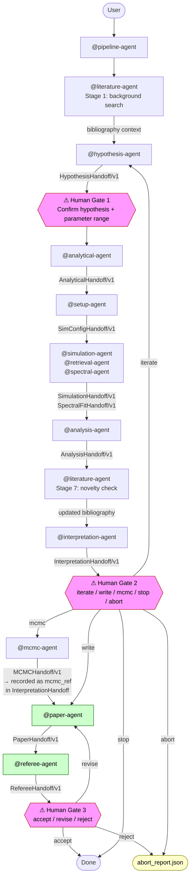
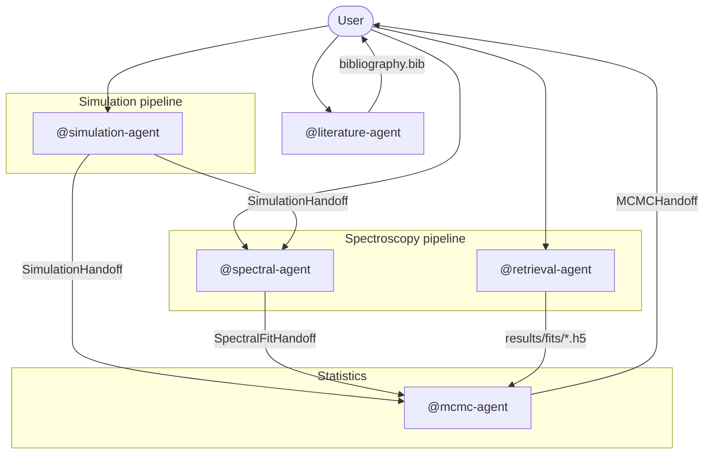

# Architecture — LMU USM Agent Template

This document is the **single source of truth** for how agents interact,
what data flows between them, and what quality gates govern each stage.

---

## Agent roster

### Research pipeline agents (new)

|          Agent          |              File               | Role | Handoff schema |
|-------------------------|---------------------------------|------|----------------|
|    `@pipeline-agent`    |    `pipeline-agent.agent.md`    | Full 10-stage research pipeline orchestrator; enforces all three human gates | — |
|   `@hypothesis-agent`   |   `hypothesis-agent.agent.md`   | Science question → ranked testable hypotheses via 3-round internal debate | [`HypothesisHandoff/v1`](.github/shared/handoff_schemas.md#hypothesishandoffv1) |
|   `@analytical-agent`   |   `analytical-agent.agent.md`   | Analytical / linear / perturbative pre-analysis; benchmarks for simulation comparison | [`AnalyticalHandoff/v1`](.github/shared/handoff_schemas.md#analyticalhandoffv1) |
|     `@setup-agent`      |     `setup-agent.agent.md`      | Translate `AnalyticalHandoff` to validated simulation configs + optional SLURM/PBS scripts | [`SimConfigHandoff/v1`](.github/shared/handoff_schemas.md#simconfighandoffv1) |
|    `@analysis-agent`    |    `analysis-agent.agent.md`    | Post-process simulation outputs + compare against analytical benchmarks | [`AnalysisHandoff/v1`](.github/shared/handoff_schemas.md#analysishandoffv1) |
| `@interpretation-agent` | `interpretation-agent.agent.md` | Physical interpretation + ADS comparison + next-action decision | [`InterpretationHandoff/v1`](.github/shared/handoff_schemas.md#interpretationhandoffv1) |
|     `@paper-agent`      | `paper-agent.agent.md` | Manuscript drafting (LaTeX), ADS citations, figure captions, compile + auto-review | [`PaperHandoff/v1`](.github/shared/handoff_schemas.md#paperhandoffv1) |
|    `@referee-agent`     | `referee-agent.agent.md` | Independent peer review (form, soundness, novelty); recommendation + Human Gate 3 | [`RefereeHandoff/v1`](.github/shared/handoff_schemas.md#refereehandoffv1) |

### Specialist agents (pre-existing)

| Agent | File | Role | Handoff schema |
|---|---|---|---|
| `@literature-agent` | `literature-agent.agent.md` | ADS search + BibTeX retrieval | — (appends to `bibliography.bib`) |
| `@simulation-agent` | `simulation-agent.agent.md` | Launch + post-process FARGO3D / PLUTO / DustPy / Magneticum | [`SimulationHandoff/v1`](.github/shared/handoff_schemas.md#simulationhandoffv1) |
| `@spectral-agent` | `spectral-agent.agent.md` | X-ray spectral fitting (Sherpa / PyXSPEC) | [`SpectralFitHandoff/v1`](.github/shared/handoff_schemas.md#spectralfithandoffv1) |
| `@retrieval-agent` | `retrieval-agent.agent.md` | Atmospheric retrievals (petitRADTRANS / dynesty) | — (writes HDF5 to `results/fits/`) |
| `@mcmc-agent` | `mcmc-agent.agent.md` | Posterior sampling + corner plots | [`MCMCHandoff/v1`](.github/shared/handoff_schemas.md#mcmchandoffv1) |

All agents share the group baseline in `.github/copilot-instructions.md`
and project-specific context in `AGENTS.md`.

---

## Research pipeline (full 10-stage)

The full research pipeline is orchestrated by `@pipeline-agent`.
Three mandatory **human gates** prevent automated progression without user confirmation.



### Stage summary

| Stage | Agent | Output |
|---|---|---|
| 0 QUESTION | `@pipeline-agent` | Creates `prompts/<task_id>_<date>.md`; initialises `paper/bibliography.bib` |
| 1 LITERATURE | `@literature-agent` | Appends to `paper/bibliography.bib` (background search) |
| 2 HYPOTHESIS | `@hypothesis-agent` | `results/hypotheses/<task_id>_<date>.json` |
| **Gate 1** | User | Confirm top hypothesis + parameter range |
| 3 ANALYTICAL | `@analytical-agent` | `results/analytical/<task_id>_<date>.py` + JSON |
| 4 SETUP | `@setup-agent` | Config files in `data/runs/<task_id>/` + optional SLURM/PBS script |
| 5 SIMULATE | `@simulation-agent` / `@retrieval-agent` / `@spectral-agent` | Binary/HDF5 outputs in `data/` |
| 6 ANALYSE | `@analysis-agent` | Figures in `plots/` + `AnalysisHandoff` JSON |
| 7b NOVELTY CHECK | `@literature-agent` | Updates `bibliography.bib`; flags prior work on same result |
| 7 INTERPRET | `@interpretation-agent` | `results/interpretation/<task_id>_<date>.json` |
| **Gate 2** | User | Confirm: iterate / write / mcmc / stop / abort |
| 8a ITERATE | `@hypothesis-agent` (optional) | Refined `HypothesisHandoff` → back to Stage 3 or 4 |
| 8b ABORT | — | `results/<task_id>/abort_report.json` (schema: `AbortReport/v1`) |
| 8c MCMC | `@mcmc-agent` (optional) | `MCMCHandoff/v1` → path recorded as `mcmc_ref` in InterpretationHandoff |
| 9 WRITE | `@paper-agent` | `paper/<task_id>_<date>/manuscript.pdf` + `referee_notes.md` |
| 10 REFEREE | `@referee-agent` | `results/referee/<task_id>_<date>.json` + `referee_review.md` |
| **Gate 3** | User | Confirm: accept / revise / reject |

---

## Direct invocation mode (without pipeline-agent)

Use this when you want to call a single specialist agent without running the
full 10-stage cycle — e.g. rerunning only the analysis after a parameter change,
or fitting a single spectrum. The `@pipeline-agent` is not involved.



---

## Data flow

### Disk / planet-formation workflow

```
@simulation-agent  →  SimulationHandoff  →  @mcmc-agent
     │                                            │
 runs/disk_gap/                          results/fits/gap_depth.json
 data/snapshots/                         plots/corner_gap_alpha.pdf
```

1. `@simulation-agent` launches FARGO3D / PLUTO / DustPy via the bundled
   skill scripts and saves binary outputs to `data/`.
2. Post-processing produces a `SimulationHandoff` JSON (gap depth,
   surface density profile, wall-clock time, unit metadata).
3. `@mcmc-agent` samples posteriors over the parameter grid and writes an
   `MCMCHandoff` JSON with medians, 68 % credible intervals, and corner plot path.

### X-ray spectroscopy workflow

```
@spectral-agent  →  SpectralFitHandoff  →  @mcmc-agent
      │                                           │
 data/spectra/                           results/fits/core.json
 results/fits/core.json                  plots/corner_nH_kT.pdf
```

1. `@spectral-agent` fits the spectrum (Sherpa / PyXSPEC), performs sanity
   checks, and writes a `SpectralFitHandoff` with best-fit parameters and
   a parameter grid for MCMC.
2. `@mcmc-agent` refines the posterior and produces a corner plot.

### Atmospheric retrieval workflow

```
@retrieval-agent  →  results/fits/<planet>_dynesty.h5  →  @mcmc-agent
```

1. `@retrieval-agent` runs petitRADTRANS CCF and dynesty retrieval, saving
   posterior samples directly as HDF5 (no intermediate handoff schema needed
   — dynesty already provides full posterior).

---

## Handoff schemas

Structured JSON schemas for inter-agent data passing are defined in
[`.github/shared/handoff_schemas.md`](.github/shared/handoff_schemas.md).

Key schemas: `SimulationHandoff/v1`, `SpectralFitHandoff/v1`, `MCMCHandoff/v1`, `PaperHandoff/v1`, `RefereeHandoff/v1`.

---

## Quality gates

Every specialist agent enforces three anti-failure mechanisms:

| Gate | Mechanism | Description |
|---|---|---|
| **IRON RULEs** | Blockquoted markers in each `.agent.md` | Non-negotiable constraints that hold even in long conversations (context rot) |
| **Anti-patterns table** | Four-row table per agent | Explicit negative examples with *Why It Fails* + *Correct Behaviour* columns |
| **Anti-leakage** | `[DATA MISSING: …]` hard stop | Agents halt and flag rather than fabricate missing data from training memory |

See the `## Iron rules` and `## Anti-patterns` sections in each agent file
and the `## Agent reliability design` section in `README.md`.

---

## References pattern for large code blocks

Agent files and skill files follow the **lean references/ pattern**:
inline code exceeding ~15 lines is extracted to a `references/` subdirectory
and loaded on demand, keeping the agent/skill file itself scannable.

| Location | Contents |
|---|---|
| `.github/agents/references/` | Simulation I/O functions and code conventions for `@simulation-agent` |
| `.github/skills/<code>/references/` | Full parameter tables and worked examples for each skill |
| `.github/shared/` | Cross-agent shared artefacts (handoff schemas) |

---

## Agentic AI in astrophysics: research landscape (2026)

This section summarises the external research context that informed the
architectural choices in this template. Sources: ReplicationBench, Stargazer,
SciAgent-Skills (BixBench), CosmoEvolve, CMBEvolve, Denario.

### Benchmark capability assessments

| Benchmark | Scope | Key result | Implication |
|---|---|---|---|
| **ReplicationBench** | 111 replication tasks across 20 peer-reviewed astrophysics papers | Best frontier models: **<20% success rate** | Agents fail not at coding but at domain-specific rigor (spline force laws, B-spline peak finding) |
| **Stargazer** | 120 RV exoplanet-fitting tasks (100 synthetic + 20 real) | Perfect χ² fit → wrong Keplerian parameters | No persistent physical world model: statistical optimisation ≠ physical understanding |

These results are why the pipeline enforces **mandatory human gates** at
hypothesis selection (Gate 1) and interpretation (Gate 2): agents currently
cannot self-verify physical consistency of their outputs.

### SKILL.md approach: empirical validation

The SciAgent-Skills project equipped Claude Code with 199 domain-specific
SKILL.md files (formatted identically to this repository's `.github/skills/`):

- **BixBench accuracy: 92.0%** — a +26.7 percentage-point improvement
  over the baseline, achieved with zero fine-tuning.
- Each skill file contains runnable code examples, key parameter definitions,
  troubleshooting matrices, and established domain best practices.
- **This directly validates our `dustpy`, `pluto`, `fargo3d`, `radmc3d`,
  `sherpa`, and `yt` skills** as an effective mechanism for specialising
  general-purpose LLMs for astrophysical workflows.

### Specialized multi-agent frameworks in our domain

| Framework | Task | Architecture | Relation to this template |
|---|---|---|---|
| **CosmoEvolve** | ACT DR6 CMB analysis | PI + Student hierarchy; shared "Blackboard" for async memory | Closest published analogue to our `@pipeline-agent` design |
| **CMBEvolve** | Weak-lensing OoD detection | Structured tree search + idea sampler | Example of quantitative, metrics-driven agentic optimisation |
| **Denario** | End-to-end paper generation | Methodology → calculation → synthesis subsystems | Inspiration for `@paper-agent`; requires expert review |
| **CMBAGENT** | CMB multi-agent calculation | Modular calculation nodes | Underpins some Denario calculation subsystems |

### Local Body, Remote Brain architecture

Recommended for astrophysics HPC environments:
- **Local Body**: Python steering scripts on the cluster execute all I/O
  (reading PLUTO `.dbl` snapshots, writing RADMC-3D inputs, launching DustPy).
  Terabytes of proprietary/embargoed data never leave the cluster.
- **Remote Brain**: the LLM (via API) orchestrates methodology, tracks
  provenance, flags physical anomalies, and generates analysis plans.
- This maps directly to: `@setup-agent` + `@simulation-agent` (local)
  ↔ `@analytical-agent` + `@interpretation-agent` (remote LLM reasoning).

### Key systemic risks

> **Actionable rules** derived from these risks live in
> `.github/copilot-instructions.md` §6 (citations), §9 (physical plausibility),
> and §10 (never do). Those sections are auto-loaded every session by Copilot
> and followed by Claude Code via the `@` reference in `CLAUDE.md`.
> The table below documents the evidence base for those rules.

| Risk | Evidence | Rule location |
|---|---|---|
| **Hallucinated citations** | ≥146,932 entirely non-existent references introduced into arXiv/PubMed in 2025 (audit of 111 M refs across 2.5 M papers) | `copilot-instructions.md §6` |
| **Physical world model gap** | Stargazer: perfect χ² fit → incorrect Keplerian orbital parameters | `copilot-instructions.md §9` |
| **Illusion of full autonomy** | ReplicationBench: <20% success — agents cannot self-verify physical consistency | `copilot-instructions.md §10` |
| **Compound RAG poisoning** | Hallucinated literature → agents recursively generate invalid science via RAG | `copilot-instructions.md §6` |
