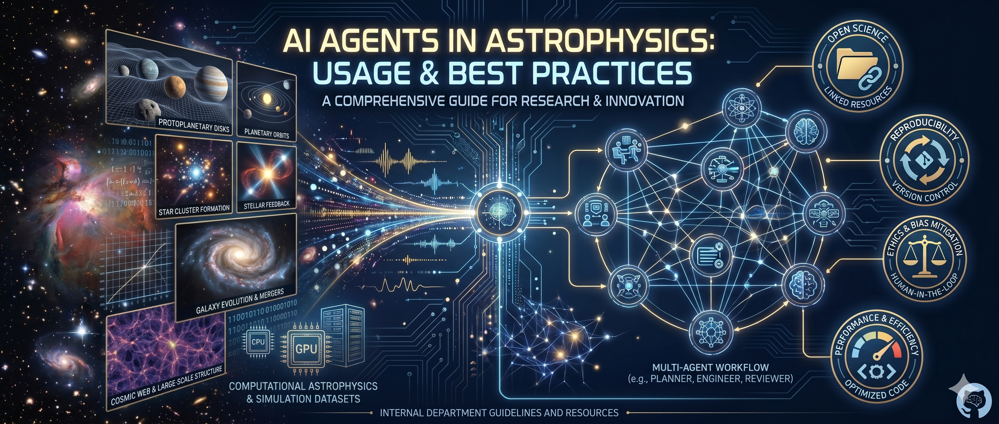

Template for using GitHub Copilot (and Claude Code) in a reproducible, citable, and
policy-compliant way in astrophysics research at LMU Munich.

**Status**: community draft — open to contributions from all group members.
**Maintainer**: Giovanni Picogna ([@GiovanniPicogna](https://github.com/GiovanniPicogna))
**Template version**: 1.1 (June 2026)

---

## What's in this repo

```
.github/
├── copilot-instructions.md   # Group-wide agent baseline (auto-loaded)
├── agents/
│   ├── pipeline-agent.agent.md     # @pipeline-agent: full 9-stage research orchestrator
│   ├── hypothesis-agent.agent.md   # @hypothesis-agent: science question → ranked hypotheses
│   ├── analytical-agent.agent.md   # @analytical-agent: analytical/linear pre-analysis
│   ├── setup-agent.agent.md        # @setup-agent: simulation configs + SLURM/PBS scripts
│   ├── analysis-agent.agent.md     # @analysis-agent: post-processing + benchmark comparison
│   ├── interpretation-agent.agent.md # @interpretation-agent: physical interpretation
│   ├── literature-agent.agent.md   # @literature-agent: ADS search & BibTeX
│   ├── simulation-agent.agent.md   # @simulation-agent: FARGO3D/PLUTO/Magneticum
│   ├── retrieval-agent.agent.md    # @retrieval-agent: petitRADTRANS CCF & dynesty
│   ├── spectral-agent.agent.md     # @spectral-agent: X-ray Sherpa/PyXSPEC fitting
│   ├── mcmc-agent.agent.md         # @mcmc-agent: emcee/dynesty sampling & corner plots
│   ├── paper-agent.agent.md        # @paper-agent: LaTeX manuscript drafting + auto-review
│   └── references/                 # Large code blocks extracted from agent files
│       ├── output_conventions.md   #   FARGO3D/PLUTO/GADGET I/O functions + unit tables
│       └── code_conventions.md     #   Script skeleton, HDF5 saving, figure naming
├── shared/
│   └── handoff_schemas.md          # JSON schemas: all 9 Handoff/v1 schemas
├── skills/                         # Bundled simulation launch + analysis skills
│   ├── dustpy/
│   │   ├── SKILL.md                #   DustPy: grain growth & radial drift
│   │   ├── references/
│   │   │   ├── customisation.md    #   Custom DustPy physics modules
│   │   │   ├── parameters.md       #   Full parameter table (lean SKILL.md pattern)
│   │   │   └── handoff.md          #   DustPy-specific SimulationHandoff/v1 emission guide
│   │   └── scripts/
│   │       ├── run_dustpy.py       #   Validated runner (SUCCESS/ERROR protocol)
│   │       └── plot_dustpy.py      #   Publication plots: panel, radial profiles, evolution
│   ├── fargo3d/
│   │   ├── SKILL.md                #   FARGO3D: planet–disk interaction & gap opening
│   │   ├── references/
│   │   │   └── parameters.md       #   Full parameter table
│   │   └── scripts/run_fargo3d.py  #   Patches .par file, launches simulation
│   ├── pluto/
│   │   ├── SKILL.md                #   PLUTO: HD/MHD disk & jet simulations
│   │   ├── references/
│   │   │   ├── parameters.md       #   Full parameter table
│   │   │   └── examples.md         #   Step-by-step run examples
│   │   └── scripts/run_pluto.py        #   Patches pluto.ini, launches simulation
│   |          compile_pluto.py    #   Compiles PLUTO from source with sysconf
│   |          physics_config_writer.py  #  Generates physics config JSON
│   |          plot_pluto.py       #   Publication-quality snapshot plots
│   ├── radmc3d/
│   │   ├── SKILL.md                #   RADMC-3D: radiative transfer, synthetic ALMA images
│   │   └── references/
│   │       └── parameters.md       #   Full parameter table
│   ├── yt/
│   │   ├── SKILL.md                #   yt: SPH/AMR volumetric analysis & projections
│   │   └── references/
│   │       └── parameters.md       #   Full parameter table
│   └── sherpa/
│       ├── SKILL.md                #   Sherpa: X-ray spectral fitting, C-stat, conf()
│       └── references/
│           └── parameters.md       #   Full parameter table
├── workflows/
│   ├── pre-commit.yml              # CI: runs hooks on every PR
│   └── pages.yml                   # CI: builds & deploys GitHub Pages
├── dependabot.yml                  # Auto-updates Actions & pre-commit pins
└── ISSUE_TEMPLATE/
    ├── new_agent.yml               # Structured form to propose a new agent
    └── bug_report.yml              # Bug report form

.vscode/
└── settings.json             # MCP server config (ADS + optional others)

ARCHITECTURE.md               # Agent roster, pipeline diagram, handoff schemas overview
CHANGELOG.md                  # Design history (Keep a Changelog format)
AGENTS.md                     # Project-specific context (fill in per project)
.gitignore                    # Astrophysics-aware gitignore
.pre-commit-config.yaml       # black, flake8, file-size guard, BibTeX DOI check
docs/                         # GitHub Pages site (Jekyll / minima)
├── index.md                  #   Landing page
├── agents.md                 #   Specialist agent documentation
├── skills.md                 #   Recommended agent skills by domain
└── _config.yml               #   Jekyll configuration
envs/
└── base.yml                  # Conda environment (Python 3.12 + full astro stack)
prompts/
└── TEMPLATE.md               # Prompt log template (copy for each task)
src/
└── utils/                    # Shared helpers (units, plotting, constants)
                              # Add domain subdirs as needed — see AGENTS.md
```

---

## Quick start

### 1. Copy this template into your project

```bash
# Option A: use as a GitHub template (click "Use this template" above)

# Option B: copy files manually into an existing repo
cp .github/copilot-instructions.md  your-project/.github/
cp .github/agents/*.md              your-project/.github/agents/
cp .vscode/settings.json            your-project/.vscode/
cp AGENTS.md                        your-project/
cp prompts/TEMPLATE.md              your-project/prompts/
cp .gitignore                       your-project/   # merge carefully
```

### 2. Set up the environment and pre-commit hooks

```bash
conda env create -f envs/base.yml
conda activate py312
pre-commit install          # installs hooks into .git/hooks/ — run once
```

After this, every `git commit` will automatically run `black`, `flake8`,
file-size checks, and BibTeX DOI validation — giving you instant local
feedback before pushing. The same checks also run in CI on every PR, so
collaborators who skip this step are still caught.

To run the hooks manually on all files at any time:

```bash
pre-commit run --all-files
```

### 3. Fill in AGENTS.md

Open `AGENTS.md` and replace every `<PLACEHOLDER>` with your project's
actual values: target name, ObsIDs, spectral model, redshift, nH, etc.

### 4. Set your ADS API token

```bash
# Add to your ~/.bashrc or ~/.zshrc:
export ADS_API_TOKEN="your_token_here"
# Get your token at: https://ui.adsabs.harvard.edu/user/settings/token
```

### 5. Open the project in VS Code / Claude Code

**VS Code + Copilot:** the MCP server starts automatically when VS Code loads. To verify:
- Open Copilot Chat
- Type: `@ads search_papers query:"intracluster medium sloshing" limit:3`
- You should get real ADS results, not hallucinated ones.

**Claude Code:** the ADS MCP server is configured in `.vscode/settings.json` and
is picked up automatically. To verify in the Claude Code conversation:
- Use the `mcp__mcp-server-ads__ads_search` tool with `query: "intracluster medium sloshing"`

### 6. Use the specialist agents

In Copilot Chat or Agent Mode:

**Full research pipeline (recommended starting point):**
```
@pipeline-agent

Science question: How does planet mass affect gap depth in a
protoplanetary disk around a 1 Msun star?

Domain: disk
Target journal: A&A
HPC mode: SLURM
Cluster account: pn29co (LRZ SuperMUC-NG)
Walltime: 24 h, 4 nodes × 48 cores
```

**Or invoke specialist agents directly:**
```
@literature-agent  Find all papers citing 2025A&A...703A.270R since 2025
                   and add them to paper/bibliography.bib

@hypothesis-agent  Generate hypotheses for how planet mass affects gap
                   depth in dusty protoplanetary disks. Domain: disk.

@analytical-agent  Compute Hill radius, Crida K, and type-I migration
                   timescale for a 1 MJup planet at 20 au.
                   HypothesisHandoff: results/hypotheses/gap_depth_20260526.json

@setup-agent       Create a FARGO3D .par file + SLURM script.
                   AnalyticalHandoff: results/analytical/gap_depth_20260526.json
                   HPC mode: SLURM, LRZ SuperMUC-NG.

@simulation-agent  Read all FARGO3D snapshots in data/runs/disk_1Mjup/
                   and compute the azimuthally averaged gap depth as a
                   function of time for planet 0. Save to results/gaps/.

@analysis-agent    Post-process data/runs/disk_1Mjup/ at snapshot 200.
                   Compare gap depth with the analytical benchmark.

@interpretation-agent  Interpret the gap depth results and decide
                        whether to iterate or write.

@retrieval-agent   Run a petitRADTRANS CCF pipeline on
                   data/spectra/obs/wasp189b_K.fits using CO and H2O
                   templates. Parameters are in AGENTS.md.

@spectral-agent    Fit an absorbed APEC model to data/spectra/core/
                   using the parameters in AGENTS.md

@mcmc-agent        Sample posteriors for the core region fit in
                   results/fits/core.json and produce a corner plot

@paper-agent       Draft the manuscript from the interpretation results.
                   InterpretationHandoff: results/interpretation/gap_depth_20260526.json
```

### 7. Log your prompts

Prompt logging is **automatic** whenever you use Agent Mode — the
instruction to create `prompts/<task>_<date>.md` as the first action
is in `.github/copilot-instructions.md`, which is loaded by every agent
(default Copilot agent and all specialist agents alike). You only need
to commit the file.

Here is the complete flow using `@spectral-agent` as an example:

**Step 1 — invoke the agent:**
```
@spectral-agent  Fit an absorbed apec model to data/spectra/obs/cluster_core/
                 in the 0.5–7.0 keV band. Parameters are in AGENTS.md.
```

**Step 2 — the agent's first action (automatic):**
Before touching any data, the agent runs:
```bash
cp prompts/TEMPLATE.md prompts/spectral_fit_cluster_core_20260515.md
```
and pre-fills the Metadata block and your exact prompt. It completes
the Output files table and validation checklist when the task finishes.

**Step 3 — commit everything together:**
```bash
git add prompts/spectral_fit_cluster_core_20260515.md \
        src/spectral/fit_core.py \
        results/fits/cluster_core.json \
        plots/cluster_core_spectrum.pdf
git commit -m "feat: X-ray spectral fit of cluster core [AI-assisted, claude-sonnet-4-6]"
```

**Step 4 — cite in your Methods section:**
> "Analysis scripts were drafted with GitHub Copilot (claude-sonnet-4-6,
> May 2026, VS Code Agent Mode). The exact prompts and all generated files
> are archived in `prompts/spectral_fit_cluster_core_20260515.md`
> (commit `abc1234`)."

---

## Journal disclosure

Use this text in your Methods section (adapt to your actual usage):

> "Analysis code was drafted with assistance from [GitHub Copilot / Claude Code]
> ([model name and version], [Month Year], [VS Code Agent Mode / Claude Code CLI]).
> Literature references were retrieved and verified via the NASA ADS API
> (cbyrohl/mcp-server-ads). All AI-generated content was reviewed and
> validated by the authors, who take full responsibility for all results."

Replace bracketed fields with the actual tool, model, and date used.
The exact model version is recorded in `prompts/<task_id>_<date>.md`.

---

## Security notes

- **Never** put API tokens in any committed file. Use environment variables.
- **Vet third-party agent skill files** before adding them: a malicious
  `.md` instruction file can override your safety rules or exfiltrate data.
  Treat agent files like code — read before you run.
- **Proprietary data**: raw XMM/Chandra observations under embargo must
  never be uploaded to any AI service. The `.gitignore` blocks FITS files
  from being committed, but you must also ensure VS Code's Copilot telemetry
  settings are appropriate for your institution.
  Check: `github.copilot.advanced.shareOpenTabsWithCopilot` (set to `false`
  if working with proprietary data).

---

## Agent skills

Skills are reusable instruction packages that extend the agent for specific
tasks without bloating the baseline. Install from:

→ **[K-Dense-AI/scientific-agent-skills](https://github.com/K-Dense-AI/scientific-agent-skills)**

In Copilot Chat, activate a skill by name:
```
Use the scientific-visualization skill for this figure.
```

### Bundled skills

This template ships six skills in `.github/skills/`. Simulation launch skills
provide a validated Python runner with Pydantic parameter checking and a
`SUCCESS` / `ERROR` exit protocol that agents parse automatically.

#### Simulation launch skills

| Skill | Code | Use case | Key parameters | Prerequisite |
|---|---|---|---|---|
| [`dustpy`](.github/skills/dustpy/SKILL.md) | DustPy | Radial dust evolution, grain growth, fragmentation, Stokes numbers | `--run_dir`, `--alpha`, `--mdisk_msun`, `--t_end_yr`, `--snaps_per_decade` | `pip install dustpy` |
| [`fargo3d`](.github/skills/fargo3d/SKILL.md) | FARGO3D | Planet–disk interaction, gap opening, type-I/II migration torques | `par_file`, `Alpha`, `PlanetMass`, `Sigma0`, `AspectRatio`, `Tmax` | Compiled `fargo3d` binary + valid `.par` file |
| [`pluto`](.github/skills/pluto/SKILL.md) | PLUTO | HD/MHD disk or jet simulations; parameter overrides without recompiling | `run_dir`, `tstop`, `CFL`, `[Parameters]` overrides, `n_procs` | Compiled `pluto` binary + valid `pluto.ini` |

#### Analysis & post-processing skills

| Skill | Domain | Use case |
|---|---|---|
| [`radmc3d`](.github/skills/radmc3d/SKILL.md) | disk | Radiative transfer; synthetic ALMA images, SEDs, scattered-light maps from PLUTO/FARGO3D/DustPy density grids |
| [`yt`](.github/skills/yt/SKILL.md) | cosmological | Volumetric analysis of GADGET/Magneticum HDF5 snapshots; projection/slice/profile/phase maps; FITS output |
| [`sherpa`](.github/skills/sherpa/SKILL.md) | X-ray | X-ray spectral fitting (TBabs\*apec, C-stat, `conf()` at 90%); XMM-Newton, Chandra, eROSITA |

Scripts accept individual flags or a single `--json` blob for multi-parameter calls:

```bash
# DustPy — 1 Myr dust evolution run
python .github/skills/dustpy/scripts/run_dustpy.py \
    --run_dir data/dust/my_run --alpha 1e-3 --mdisk_msun 0.05 --t_end_yr 1e6

# DustPy — diagnostic plots (panel overview, radial profiles, space-time evolution)
python .github/skills/dustpy/scripts/plot_dustpy.py \
    --run_dir data/dust/my_run --plot all --out plots/dust/my_run

# FARGO3D — planet-gap simulation, overriding planet mass and viscosity
python .github/skills/fargo3d/scripts/run_fargo3d.py \
    --json '{"par_file": "setups/p_gap/p_gap.par", "Alpha": 1e-3, "PlanetMass": 3e-4}'

# PLUTO — HD disk run in an existing compiled directory
python .github/skills/pluto/scripts/run_pluto.py \
    --json '{"run_dir": "runs/disk_gap", "tstop": 500.0, "parameters": {"ALPHA": 1e-3}}'
```

Skill files follow the **lean SKILL.md pattern**: `SKILL.md` contains the essentials
(trigger conditions, procedure, compact parameter summary, output format, error table).
Detailed parameter tables and worked examples live in each skill’s `references/`
subdirectory and are loaded by the agent on demand.

Recommended skills by domain are listed in [`docs/skills.md`](https://giovannipicogna.github.io/lmu-usm-agent-template/skills).

### Community skills by domain

Install from → https://github.com/K-Dense-AI/scientific-agent-skills

*Universal (all groups)*

| Skill | Invoke when… |
|-------|-------------|
| `astropy` | coordinate transforms, FITS I/O, cosmological distances, WCS |
| `matplotlib` | any publication plot needing fine-grained control |
| `scientific-visualization` | multi-panel journal figures (Nature/A&A style, colourblind palettes) |
| `statistical-analysis` | choosing and running statistical tests, power analysis |
| `paper-lookup` | searching PubMed / arXiv / OpenAlex / Semantic Scholar |
| `citation-management` | verifying BibTeX, converting DOIs, formatting references |

*Disk & planet formation*

| Skill | Invoke when… |
|-------|-------------|
| `database-lookup` | querying SIMBAD, VizieR, ALMA archive, ExoFOP |
| `exploratory-data-analysis` | first look at a new simulation output or data file |
| `scientific-schematics` | disk structure diagrams, gap morphology schematics |
| `sympy` | analytical dispersion relations, stability criteria, linear perturbation theory |

*Cosmological simulations*

| Skill | Invoke when… |
|-------|-------------|
| `networkx` | building merger trees or substructure graphs |
| `umap-learn` | dimensionality reduction for halo/galaxy populations |
| `scikit-learn` | classification / regression on simulation catalogues |

*Atmospheric retrievals & high-res spectroscopy*

| Skill | Invoke when… |
|-------|-------------|
| `statsmodels` | frequentist inference, ARIMA detrending of time series |
| `shap` | interpreting ML-based retrieval or classification models |
| `database-lookup` | querying ExoAtmospheres, HITRAN, ExoMol line lists |

*X-ray & galaxy clusters*

| Skill | Invoke when… |
|-------|-------------|
| `imaging-data-commons` | accessing NCI / public X-ray / CT imaging datasets |
| `pydicom` | reading DICOM files from medical / detector calibration data |

---

## Agent reliability design

Each specialist agent includes three anti-failure mechanisms:

### Iron rules
Blockquoted `IRON RULE` markers inside every agent file flag non-negotiable
constraints that must hold even in long conversations (context rot).

| Agent | Critical rules |
|---|---|
| `@pipeline-agent` | Never skip a human gate; never auto-submit HPC jobs; stop after 3 failed iterations |
| `@hypothesis-agent` | All refs via ADS MCP — never invent bibcodes; Gate 1 is mandatory |
| `@analytical-agent` | Use `astropy.units` — no magic number conversions; flag nonlinear regime explicitly |
| `@setup-agent` | Never call `sbatch`/`qsub`; never overwrite existing configs; read cluster details from `AGENTS.md` |
| `@analysis-agent` | Never proceed if `sanity_passed: false`; SHA256-hash all output files |
| `@interpretation-agent` | No findings without ADS support; Gate 2 is mandatory before user decision |
| `@simulation-agent` | No hallucinated numbers; read-only by default; test before batch |
| `@spectral-agent` | No hallucinated fit results; C-stat on low counts; model changes need confirmation |
| `@mcmc-agent` | 68% intervals (not 90%); never overwrite chains; convergence before reporting |
| `@paper-agent` | Numbers from AnalysisHandoff only; ADS-verified citations; LaTeX must compile; claims cross-checked against diagnostics |
| `@retrieval-agent` | No detections without null test; species list from `AGENTS.md`; convergence before reporting |

### Anti-patterns table
Each agent carries a four-row table with columns
*Anti-Pattern | Why It Fails | Correct Behaviour*, providing explicit
negative examples at inference time to counter the most common failure modes.

### Anti-leakage (`[DATA MISSING]`)
Every analysis agent's Role section includes a hard stop:
> If required data is not present in the current session, emit
> `[DATA MISSING: <path or description>]` and stop — do not substitute values from training memory.

`@literature-agent` uses the variant `[CITATION MISSING: <query>]` when ADS
returns no result. These markers make silent hallucination visible: a
`[DATA MISSING]` reply means the agent is correctly refusing to invent data
rather than producing a plausible-looking but fabricated result.

---

## Testing

The repository ships a pytest test suite that validates the pipeline's
**infrastructure layer**: handoff data contracts, anti-hallucination guards,
agent structural definitions, simulation script parameter bounds, hook safety
patterns, and cross-reference consistency between all configuration files.

### Running the tests

```bash
conda activate py312
pytest tests/                  # full suite
pytest tests/schemas/          # handoff JSON contracts only
pytest tests/agents/           # gates, agent structure, cross-references
pytest tests/skills/           # skill SKILL.md structure + script parameter bounds
pytest tests/guards/           # [DATA MISSING] sentinel and format validators
pytest tests/ -v --tb=short    # verbose output with short tracebacks
```

### What the tests cover

| Directory | Validates |
|---|---|
| `tests/schemas/` | All 9 handoff JSON contracts as Pydantic v2 models — field types, cross-field constraints, validation rules from `.github/shared/handoff_schemas.md` |
| `tests/guards/` | `[DATA MISSING]` sentinel detection; ADS bibcode format (19-character regex); ISO-8601 UTC timestamp format |
| `tests/agents/` | Human Gate 1 & 2 enforcement; `next_action` routing consistency; Iron Rules presence and numbering in all `.agent.md` files; cross-reference consistency (ARCHITECTURE.md ↔ agent files ↔ handoff schemas ↔ skill directories ↔ CLAUDE.md) |
| `tests/skills/` | `SKILL.md` required sections; script file existence; Pydantic parameter bounds for `run_fargo3d.py`, `compile_pluto.py`, `run_pluto.py`; mutual exclusion rules for PLUTO physics flags; `physics_config_writer.py` C-expression evaluator; `SUCCESS`/`ERROR` stdout protocol for all simulation launchers |

All simulation-code-dependent tests (`run_dustpy.py`, `plot_dustpy.py`,
`plot_pluto.py`) are skipped automatically when the corresponding Python package
(`dustpy`, `pyPLUTO`) is not installed, so the suite runs cleanly in any
environment with only `numpy`, `scipy`, `pydantic`, and `pyyaml`.

### What the tests do not cover

These tests validate the **scaffolding** around the LLMs, not LLM behavior at
runtime:

- Whether the LLM follows Iron Rules during a conversation (structural presence
  ≠ runtime compliance).
- Whether handoff field *values* are physically meaningful — Pydantic validates
  types and ranges, not domain physics.
- Whether Gate 1 or Gate 2 are truly enforced by the LLM — the routing function
  tests verify the Python check, not that the LLM won't auto-confirm.
- Hallucinated citations — tests verify ADS bibcode format, not ADS-MCP
  round-trip validity.

Runtime behavioral robustness is handled by the two mandatory human gates
(Gate 1 after hypothesis, Gate 2 after interpretation) and the
`[DATA MISSING]` anti-leakage pattern. See
[`ARCHITECTURE.md § Quality gates`](ARCHITECTURE.md) for the full reliability
design.

---

## Pipeline architecture

See [`ARCHITECTURE.md`](ARCHITECTURE.md) for the complete picture:
Mermaid flowchart of the full pipeline (including both human gates and the
Stage 7b literature novelty check), full agent roster table (13 agents),
stage-by-stage summary, and the quality-gate summary.

### Structured handoffs between agents

When one specialist agent finishes and a downstream agent needs its results, it
emits a **handoff JSON** whose schema is defined in
[`.github/shared/handoff_schemas.md`](.github/shared/handoff_schemas.md).
Nine schemas are currently defined:

| Schema | Emitted by | Consumed by |
|---|---|---|
| `HypothesisHandoff/v1` | `@hypothesis-agent` | `@analytical-agent` |
| `AnalyticalHandoff/v1` | `@analytical-agent` | `@setup-agent` |
| `SimConfigHandoff/v1` | `@setup-agent` | `@simulation-agent`, `@retrieval-agent`, `@spectral-agent` |
| `SimulationHandoff/v1` | `@simulation-agent` | `@analysis-agent`, `@mcmc-agent` |
| `SpectralFitHandoff/v1` | `@spectral-agent` | `@analysis-agent`, `@mcmc-agent` |
| `AnalysisHandoff/v1` | `@analysis-agent` | `@interpretation-agent` |
| `InterpretationHandoff/v1` | `@interpretation-agent` | `@hypothesis-agent` (iterate), `@paper-agent` (write), `@mcmc-agent` (mcmc), or user (stop / abort) |
| `MCMCHandoff/v1` | `@mcmc-agent` | user |
| `PaperHandoff/v1` | `@paper-agent` | user |

Each schema includes a `sanity_passed` / `validated` / `converged` gate: the
receiving agent will refuse to proceed if the gate is `false`.

The **two mandatory human gates** in the pipeline are enforced by
`@hypothesis-agent` (Gate 1 — confirm top hypothesis) and
`@interpretation-agent` (Gate 2 — confirm `iterate` / `write` / `mcmc` /
`stop` / `abort`). Neither gate can be bypassed programmatically.
An `abort` decision writes `results/<task_id>/abort_report.json` — a
citable record of inconclusive or blocked results.

---

## GitHub Pages

The `docs/` folder is automatically deployed to GitHub Pages on every push to `main`.

→ **https://giovannipicogna.github.io/lmu-usm-agent-template**

To enable Pages in a fork or your own copy of this template:
1. Go to **Settings → Pages**
2. Set **Source** to `GitHub Actions`
3. Push any change to trigger the first build

---

## Customising the template

### Scoped per-filetype instructions (Copilot-only)

Since July 2025, Copilot supports glob-scoped instruction files that activate
only for matching file types or directories — keeping `.github/copilot-instructions.md`
focused on universal group conventions. Create them in `.github/instructions/`:

```
.github/instructions/
├── python.instructions.md       # applyTo: "**/*.py"
├── simulation.instructions.md   # applyTo: "src/simulation/**"
└── notebooks.instructions.md    # applyTo: "**/*.ipynb"
```

Frontmatter example:

```markdown
---
applyTo: "**/*.py"
---
Always use type hints. Prefer `astropy.units.Quantity` over bare floats.
Never hardcode physical constants — import from `astropy.constants`.
```

This is a Copilot-specific feature; it has no equivalent in `AGENTS.md`.
For rules that must apply to all tools (Copilot, Claude Code, Cursor), put them
in `AGENTS.md` or `.github/copilot-instructions.md` instead.

---

## Contributing

Suggestions and improvements welcome. Open an issue or PR.
